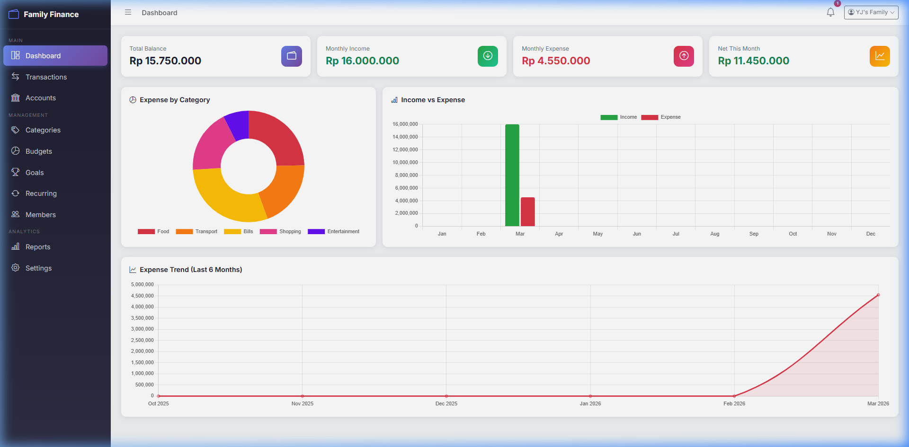
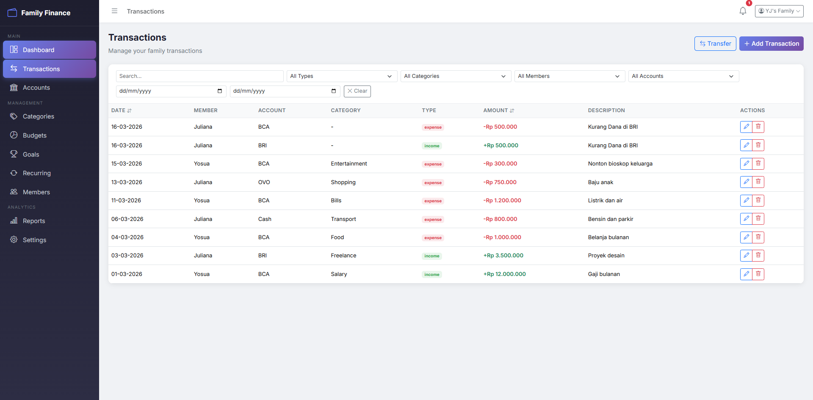
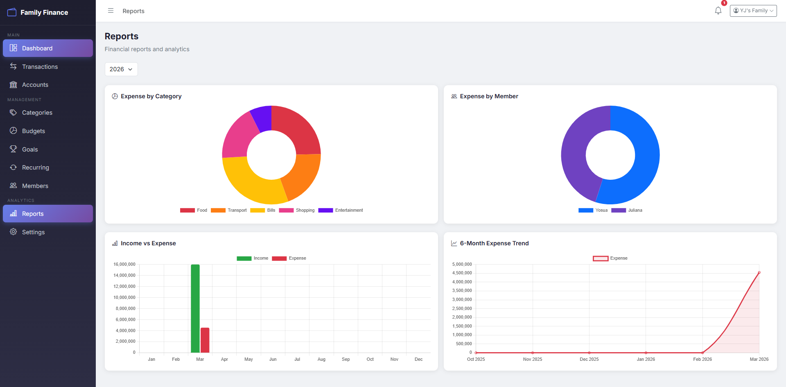
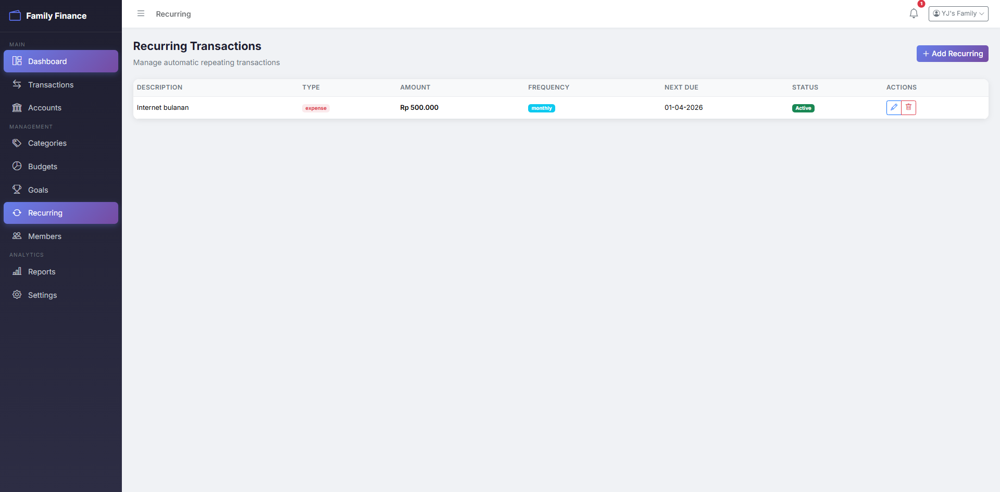
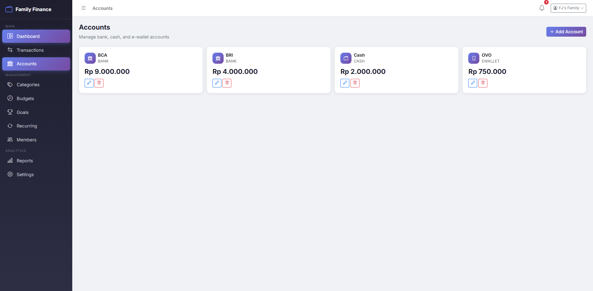
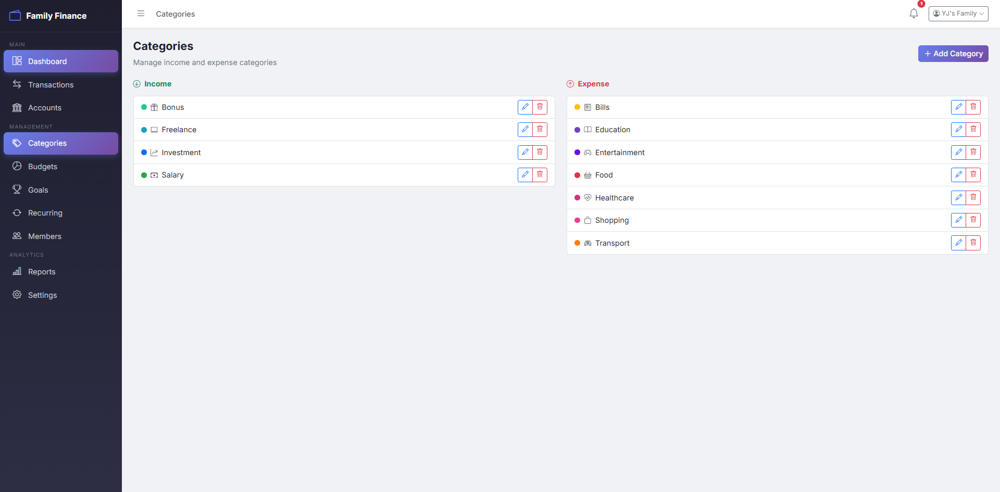

# Sistem Manajemen Keuangan Keluarga

Aplikasi pencatatan keuangan keluarga yang siap digunakan pada lingkungan produksi (production-ready). Sistem ini dirancang untuk digunakan oleh satu keluarga (menggunakan satu akun utama sebagai pusat) dengan beberapa anggota individu yang dapat mencatat pemasukan, pengeluaran, anggaran, target tabungan, dan transaksi berulang dalam satu dashboard terpadu.

Sistem ini menyediakan pencatatan akuntansi **dual-entry** untuk transfer antar akun serta **notifikasi real-time pada frontend** ketika penggunaan anggaran mendekati batas tertentu.

## Struktur Proyek

Repositori ini menggunakan struktur **monorepo** yang berisi aplikasi frontend dan backend:

- [`/supabase`](./supabase) - Database schema, migrations, Row Level Security (RLS) policies, and pg_cron definitions for automated background tasks.
- [`/frontend`](./frontend) - Vue 3 Single Page Application (SPA). Antarmuka pengguna yang responsif dan dinamis yang dibangun menggunakan Vite, Vue Router, Pinia, Bootstrap, dan Chart.js. Terhubung langsung ke Supabase melalui `@supabase/supabase-js`.

## Arsitektur

- **Backend & Database**: Supabase (PostgreSQL 15+)
- **Authentication**: Supabase Auth
- **Business Logic**: PostgreSQL Functions (RPC) & Database Triggers
- **Background Jobs**: pg_cron (Supabase Extension)
- **Frontend Framework**: Vue 3 (Composition API)
- **Build Tool**: Vite
- **State Management**: Pinia
- **Styling**: Custom CSS berbasis Bootstrap 5
- **Charts**: Chart.js dengan Dynamic Golden Ratio Colors
- **AI Engine**: Google Gemini API (`gemini-flash-lite-latest`)
- **OCR Engine**: Tesseract.js (Offline Client-Side OCR)

## Fitur Utama

1.  **Manajemen Anggota**: Menambahkan anggota keluarga dan mengaitkan transaksi kepada masing-masing anggota.
2.  **Manajemen Akun**: Melacak saldo pada kas, rekening bank, dan e-wallet. Saldo terupdate otomatis menggunakan _Database Triggers_.
3.  **Pencatatan Transaksi**: Mencatat pemasukan, pengeluaran, serta transfer antar akun.
4.  **Anggaran (Budget)**: Menentukan batas pengeluaran bulanan per kategori dengan progress bar real-time serta **Budget Guardrail** (peringatan modal interaktif) dan notifikasi _bell_ jika mendekati/melebihi 80%.
5.  **Kantong Proyek (Project Pockets)**: Memisahkan dana untuk acara/proyek besar secara independen. Pengeluaran di Kantong Proyek **tidak mengganggu** limit Anggaran Bulanan reguler.
6.  **Daftar Belanja Cerdas & Scan Struk (OCR)**: Mencatat rencana belanja dan mencentangnya secara real-time. Dilengkapi fitur unggah/scan foto struk yang diekstraksi secara offline (sisi client) menggunakan Tesseract.js untuk mendeteksi nama toko, tanggal, dan nominal transaksi secara otomatis.
7.  **Target Tabungan (Saving Goals)**: Melacak target dana dengan progress persentase interaktif, terhubung dengan akun, dan terintegrasi mulus dengan Kantong Proyek saat target telah tercapai.
8.  **Transaksi Berulang (Recurring Transactions)**: Sistem penjadwalan otomatis menggunakan **pg_cron** di level database yang mencatat pengeluaran berulang (mingguan, bulanan, tahunan) di belakang layar.
9.  **Dashboard Analitik**: Menyediakan laporan visual tren pengeluaran, perbandingan pemasukan/pengeluaran, dan pie chart distribusi kategori.
10. **Modern UI/UX**: Tampilan dinamis, bersih, dan memanjakan mata dengan dukungan Light/Dark Mode serta transisi animasi yang mulus.
11. **Eksport Laporan (_Client-Side_)**: Unduh laporan keuangan ke format **CSV** dan **PDF** terstruktur langsung dari browser.
12. **Keamanan Berlapis (RLS)**: Row Level Security memastikan data satu keluarga terisolasi secara sempurna dan tidak bisa diakses oleh keluarga lain.
13. **Asisten Keuangan AI (Aurora AI Advisor)**: Fitur konsultasi keuangan interaktif dengan tampilan glassmorphic premium. AI menganalisis kondisi keuangan keluarga (saldo, anggaran, pencapaian target tabungan, dan riwayat transaksi terbaru) untuk memberikan saran keuangan cerdas dan personal dalam Bahasa Indonesia maupun Inggris.
14. **Sinkronisasi API Key Lintas Perangkat**: API Key Gemini dapat disimpan langsung ke profil keluarga di database Supabase yang diamankan oleh kebijakan Row Level Security (RLS). Semua anggota keluarga di berbagai perangkat/browser dapat menggunakan AI Advisor secara instan tanpa perlu memasukkan API Key berulang kali.

## Setup AI Assistant (Graphify)

Repositori ini telah dikonfigurasi secara mendalam untuk menggunakan [Graphify](https://github.com/safishamsi/graphify) guna membangun *knowledge graph* arsitektur kode. Ini memungkinkan asisten AI (seperti Google Antigravity, Cursor, atau Claude) menavigasi codebase dengan instan tanpa menghabiskan banyak token API.

**Untuk Developer Baru yang Meng-clone Repo Ini:**
1. Anda tidak perlu membangun *graph* dari awal! Kami sudah meng-commit folder `graphify-out/` sebagai *map* bawaan. AI Anda akan langsung membacanya.
2. Silakan install tool CLI Graphify di komputer Anda jika belum ada (misal dengan `pipx install "graphifyy[gemini]"`).
3. Jalankan `graphify hook install` di folder project ini. Hal ini akan memasang Git hook (`post-commit`) sehingga setiap kali Anda melakukan commit kode baru, Graphify akan otomatis mengupdate peta kode di latar belakang (tanpa biaya API).

## Roadmap Deployment

Aplikasi ini menggunakan arsitektur _BaaS (Backend-as-a-Service)_ berbasis Supabase. 

**Panduan Lengkap:** 👉 **[Lihat Panduan Konfigurasi & Integrasi Supabase](docs/supabase-setup-guide.md)**

1. Database dan Backend dapat langsung dideploy ke project Supabase menggunakan Supabase CLI (`npx supabase db push`).
2. Frontend dapat dideploy ke layanan _static hosting_ manapun (seperti Vercel, Netlify, atau Cloudflare Pages) dengan konfigurasi environment `VITE_SUPABASE_URL` dan `VITE_SUPABASE_PUBLISHABLE_KEY`.

## Tangkapan Layar (Screenshots)

Berikut adalah beberapa tampilan halaman dari aplikasi:

### 1. Dashboard Utama

### 2. Transaksi (Transactions)

### 3. Anggaran (Budgets)

### 4. Target Tabungan (Goals)

### 5. Laporan Analitik (Reports)

### 6. Transaksi Berulang (Recurring)

### 7. Kelola Anggota Kawanan (Members)

### 8. Rekening & Dompet (Accounts)

### 9. Kategori Pemasukan & Pengeluaran (Categories)

### 10. Pengaturan Profil (Settings)

### 11. Asisten Keuangan AI (AI Advisor)

# f i n a l - f i n a n c e - f a m i l y
