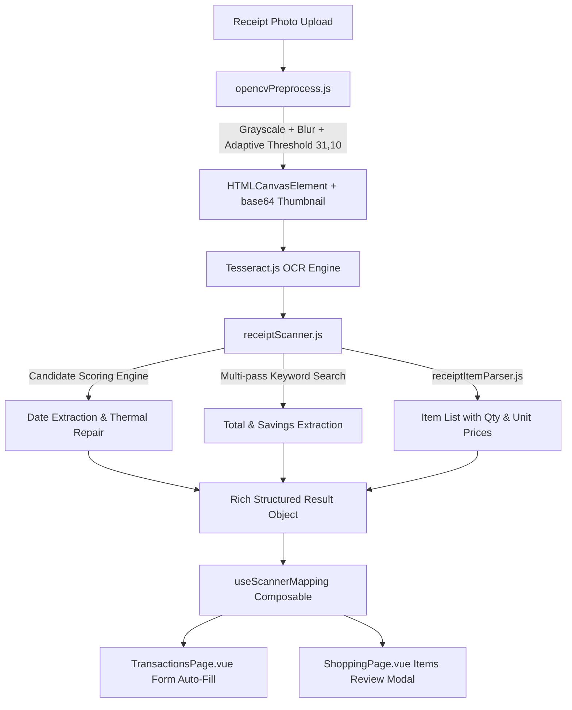

# Walkthrough — Receipt Scanner Module Full Rebuild

## Overview & Architecture

We executed a comprehensive ground-up rebuild of the receipt scanning ecosystem across `TransactionsPage.vue`, `ShoppingPage.vue`, and the core scanner utility files.

---

## Key Improvements Delivered

### 1. Shared Scanner Mapping Composable ([`useScannerMapping.js`](file:///c:/Projects/final-finance-family/frontend/src/composables/useScannerMapping.js))
* Extracted 100+ lines of duplicate category, account, and member heuristic mapping logic out of Vue components into a clean, reusable composable.
* Provides `mapCategory()`, `mapAccount()`, and `mapMember()` functions used by both **Transactions** and **Shopping Plan** modules.

### 2. Candidate Scoring Date Engine ([`receiptScanner.js`](file:///c:/Projects/final-finance-family/frontend/src/utils/receiptScanner.js))
* Replaced fragile single-pass date regex and hardcoded month fixing with a **Date Candidate Scoring Engine**.
* Scans all candidate dates across the receipt, evaluates position weight (footers scored higher), recent plausibility vs scan date, context keywords (`trans`, `jam`, `date`), and thermal dot-matrix `7 → 1` misread corrections.

### 3. Enhanced OpenCV Preprocessing & Thumbnail Export ([`opencvPreprocess.js`](file:///c:/Projects/final-finance-family/frontend/src/utils/opencvPreprocess.js))
* Integrated base64 thumbnail generation (`processedImageDataUrl`).
* Rendered preprocessed OpenCV black-and-white image side-by-side with raw OCR text in the collapsible review panel.

### 4. Rich Shopping Review & Item Parser ([`ShoppingPage.vue`](file:///c:/Projects/final-finance-family/frontend/src/pages/ShoppingPage.vue) & [`receiptItemParser.js`](file:///c:/Projects/final-finance-family/frontend/src/utils/receiptItemParser.js))
* `scanReceipt()` now returns pre-parsed line items directly, avoiding duplicate OCR parsing.
* Item review modal in `ShoppingPage.vue` displays item names, quantity input fields, total price, and auto-calculated per-unit prices (`3x @ Rp 46,500 / unit`).

---

## Verification Results

### Build Verification
- Production build (`npm run build`) completed cleanly with 0 errors (`✓ built in 37.79s`).
- Codebase Knowledge Graph updated via `graphify update .`.
- Pushed to `origin/main` (`54a467f`).
